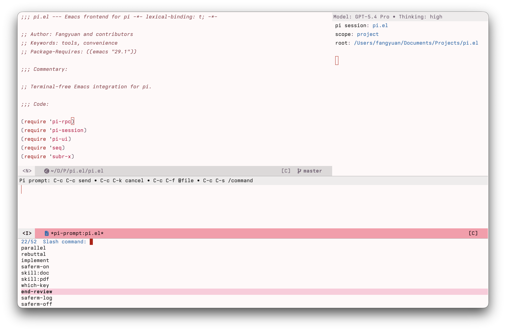

# pi.el

`pi.el` is a terminal-free Emacs frontend for the [`pi`](https://github.com/mariozechner/pi-coding-agent) coding agent.

It starts hidden `pi --mode rpc` subprocesses, keeps one session per project or directory scope, and renders conversation output in Emacs side windows. The package is meant to stay lightweight, editor-native, and easy to use from the buffer you are already working in.

## Status

Early and evolving. This package targets `@mariozechner/pi-coding-agent` 0.73.0 or newer and intentionally follows the current RPC protocol without compatibility shims for older pi releases.

## Features

- terminal-free RPC integration with `pi --mode rpc`
- one hidden pi session per project root or directory scope
- side-window session buffer with live streaming output
- prompt composer buffer with editor-native editing
- `@file` completion from project files
- `/command` completion from the running pi session
- saved session resume support
- model selection and thinking-level controls
- session compaction, abort, reload, and HTML export
- compact or verbose tool-result rendering
- optional `markdown-mode` rendering for session buffers

## Current workflow

The current package centers on a scope-bound session buffer:

1. open a session for the current buffer
2. compose a prompt in Emacs
3. send it to the hidden pi RPC process
4. watch streamed output in a side window
5. continue the conversation, resume old sessions, or switch models as needed

## Difference from `dnouri/pi-coding-agent`

This repo is closely related in spirit, but it is intentionally different in a few ways:

- **smaller surface area** — this repo aims to stay relatively small and easy to reason about
- **buffer-oriented usage** — it is biased toward lightweight usage from the current buffer instead of a richer chat workspace
- **simpler window model** — it uses a session side window plus an on-demand prompt composer, rather than a persistent chat-buffer/input-buffer pair as the core UX
- **lighter UI ambitions** — fewer integrated controls and less session-management UI than `dnouri/pi-coding-agent`

If you want the more established chat-first Emacs frontend, use `dnouri/pi-coding-agent`. If you want a smaller package that can evolve toward a tighter current-buffer workflow, this repo explores that direction.
